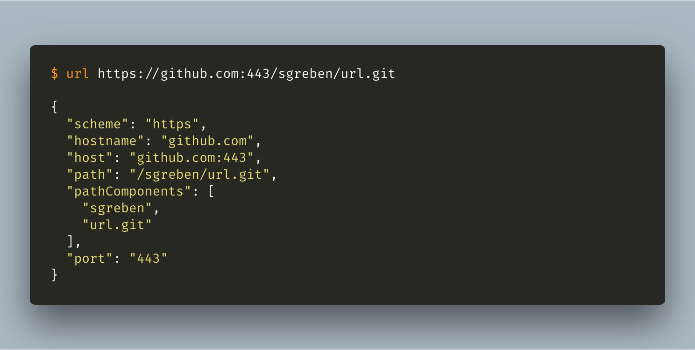

# url - command-line URL parser

`url` parses its arguments as URLs and prints a structured representation (JSON or go template) to stdout.




- [Get it](#get-it)
- [Use it](#use-it)
    - [JSON output](#json-output)
    - [Template output](#template-output)
    - [Setting URL components](#setting-url-components)
- [Comments](https://github.com/sgreben/url/issues/1)

## Get it

Using go get:

```bash
go get -u github.com/sgreben/url/cmd/url
```

Or [download the binary](https://github.com/sgreben/url/releases/latest) from the releases page. 

```bash
# Linux
curl -L https://github.com/sgreben/url/releases/download/${VERSION}/url_${VERSION}_linux_x86_64.tar.gz | tar xz

# OS X
curl -L https://github.com/sgreben/url/releases/download/${VERSION}/url_${VERSION}_osx_x86_64.tar.gz | tar xz

# Windows
curl -LO https://github.com/sgreben/url/releases/download/${VERSION}/url_${VERSION}_windows_x86_64.zip
unzip url_${VERSION}_windows_x86_64.zip
```

Also available as a [docker image](https://quay.io/repository/sergey_grebenshchikov/url?tab=tags):

```bash
docker pull quay.io/sergey_grebenshchikov/url
```

## Use it

`url` reads URLs from CLI arguments and writes to stdout.

```text
Usage of url:
  -t string
    	alias for -template
  -template string
    	go template output
  -p	alias for -plain
  -plain
    	plain URL output (useful with -set-* flags)
  -r	alias for -resolve
  -resolve
    	resolve ../ in URLs
  -set-fragment value
    	set the fragment component
  -set-host value
    	set the host component
  -set-hostname value
    	set the hostname component
  -set-opaque value
    	set the opaque component
  -set-path value
    	set the path component
  -set-port value
    	set the port component
  -set-query value
    	set the (raw) query component
  -set-scheme value
    	set the scheme component
  -set-username value
  -set-no-username
        set the username component
  -set-password value
  -set-no-password
        set the password component
  -version
    	print version and exit
```

### JSON output

The default output format is JSON, one object per line:

```bash
$ url https://github.com/sgreben/url/cmd/url
```

```json
{"scheme":"https","hostname":"github.com","host":"github.com","path":"/sgreben/url/cmd/url","pathComponents":["sgreben","url","cmd","url"],"query":{},"port":"","fragment":""}
```

### Template output

You can specify an output template using the `-template` parameter and [go template](https://golang.org/pkg/text/template) syntax:

```bash
$ url -t .Hostname https://github.com/sgreben/url/cmd/url
```

```text
github.com
```

The fields available to the template are specified in the [`flatURL` struct](cmd/url/main.go#L15).

### Setting URL components

You can modify the URLs before they are printed using the `-set-*` parameters. This probably most useful together with the `-p` (plain URL) output:

```bash
$ url -p -set-port 443 https://github.com/sgreben/url/cmd/url
```

```text
https://github.com:443/sgreben/url/cmd/url
```

This can also be used to build URLs:

```bash
$ url -p -set-host github.com -set-scheme https -set-path /sgreben/url/cmd/url ""
```

```text
https://github.com/sgreben/url/cmd/url
```

## Comments

Feel free to [leave a comment](https://github.com/sgreben/url/issues/1) or create an issue.